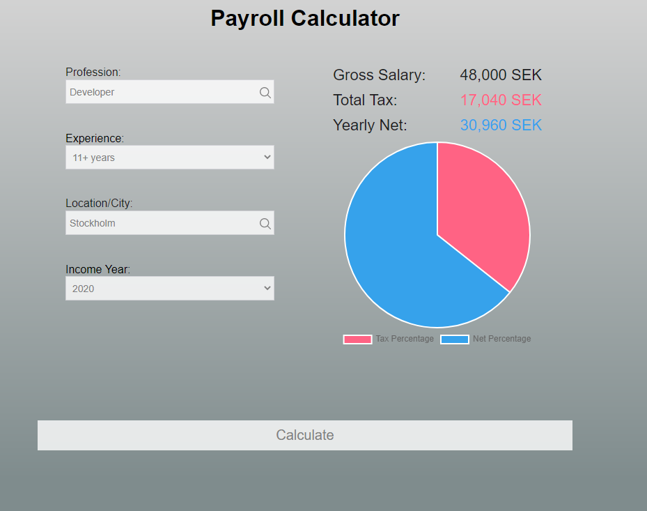

### Installation and use

Clone this repository:

```
git clone git@github.com:mmirzaei559/payroll-calculator.git
```

Install npm packages:

```
npm install
```

Start working:

```
npm start
```

## Short description

### What this application does?

This software allows users to enter information such as profession, amount of expertise, city of residence, and income year to calculate their total gross income, net income, and annual tax rate, as well as the percentage of tax paid to total income.

### What technologies are used?

React.js, Redux library for managing and centralizing application state as well as Styled-components to write actual CSS in your JavaScript, chart.js for data visualization, and Jest.js for JavaScript testing.